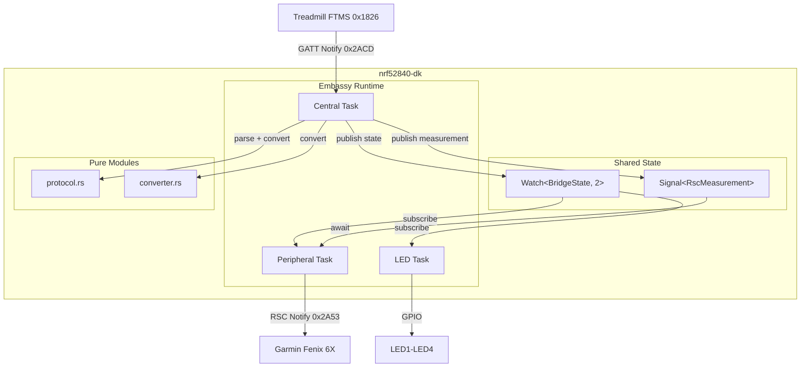
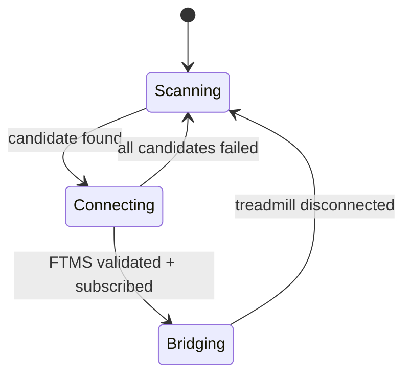

# Design Document: FTMS-RSC Bridge

## Overview

TreadLink is a BLE bridge firmware for the nrf52840-dk that connects to an FTMS-enabled treadmill (Central role), converts speed and distance data, and re-exposes it as a Running Speed and Cadence (RSC) peripheral for consumption by a Garmin Fenix 6X watch.

The firmware uses Embassy's cooperative async runtime with three tasks communicating via lock-free synchronization primitives. The BLE stack is trouble-host v0.6 (pure-Rust) backed by the Nordic SoftDevice Controller (nrf-sdc v0.3) with a hard 2-connection cap (1 central + 1 peripheral).

### Key Design Decisions

| Decision | Choice | Rationale |
|----------|--------|-----------|
| BLE controller | nrf-sdc v0.3 | Nordic SoftDevice Controller, proven on nrf52840, supports concurrent central+peripheral |
| Connection cap | 2 (1 central, 1 peripheral) | Minimum needed; reduces RAM and scheduling complexity |
| Inter-task data | `Signal<CriticalSectionRawMutex, RscMeasurement>` | Latest-value-only, zero-alloc, single-producer/single-consumer |
| State broadcast | `Watch<BridgeState, 2>` | Multiple subscribers (peripheral + LED), change-driven wakeup |
| Notification rate | Treadmill-driven | Fire RSC notification on each FTMS receive — no independent timer |
| Speed formula | `(ftms_speed as u32 * 32) / 45` | Integer-only, truncating division, fits u16 for all inputs |
| Module split | `protocol.rs` + `converter.rs` | Byte parsing/serialization separated from unit math and struct assembly |

## Architecture



### State Machine



### Task Responsibilities

| Task | Owns | Communicates via |
|------|------|-----------------|
| `central_task` | BLE Central (scan, connect, GATT discovery, FTMS subscription, notification Rx) | Publishes to Signal + Watch |
| `peripheral_task` | BLE Peripheral (advertise, GATT server, RSC notify, SC Control Point) | Reads Signal, subscribes Watch |
| `led_task` | GPIO for LED1–LED4 | Subscribes Watch |

## Components and Interfaces

### `main.rs` — Initialization and Task Spawning

```rust
// Static resources (via static_cell)
static SDC_MEM: StaticCell<[u8; SDC_MEM_SIZE]> = StaticCell::new();
static HOST_RESOURCES: StaticCell<HostResources<..>> = StaticCell::new();
static SIGNAL: StaticCell<Signal<CriticalSectionRawMutex, RscMeasurement>> = StaticCell::new();
static WATCH: StaticCell<Watch<CriticalSectionRawMutex, BridgeState, 2>> = StaticCell::new();

#[embassy_executor::main]
async fn main(spawner: Spawner) {
    // 1. Init embassy-nrf peripherals
    // 2. Init nrf-sdc controller (2 connections, central+peripheral)
    // 3. Init trouble-host stack
    // 4. Create Signal and Watch statics
    // 5. Spawn central_task, peripheral_task, led_task
}
```

### `central.rs` — Central Task

```rust
pub struct ScanCandidate {
    pub address: BdAddr,
    pub rssi: i8,
}

#[embassy_executor::task]
pub async fn central_task(
    central: Central<'static>,
    signal: &'static Signal<CriticalSectionRawMutex, RscMeasurement>,
    watch: &'static Watch<CriticalSectionRawMutex, BridgeState, 2>,
) {
    loop {
        // 1. Publish Scanning state
        // 2. Scan 3s, collect up to 4 candidates sorted by RSSI desc, discard < -70 dBm
        // 3. For each candidate (strongest first):
        //    a. Connect (5s timeout)
        //    b. GATT discover (5s timeout), verify 0x2ACD
        //    c. Subscribe to notifications
        //    d. On success: publish Connecting → Bridging
        // 4. Receive loop: parse FTMS → convert → signal.signal(measurement)
        // 5. On disconnect: publish Scanning, restart loop
    }
}
```

### `peripheral.rs` — Peripheral Task

```rust
#[gatt_server]
pub struct RscServer {
    pub rsc: RscService,
}

#[gatt_service(uuid = "1814")]
pub struct RscService {
    #[characteristic(uuid = "2A53", notify)]
    pub measurement: [u8; 8],

    #[characteristic(uuid = "2A54", read, value = [0x02, 0x00])]
    pub feature: [u8; 2],

    #[characteristic(uuid = "2A5D", read, value = [0x02])]
    pub sensor_location: u8,

    #[characteristic(uuid = "2A55", write, indicate)]
    pub sc_control_point: [u8; 5],
}

#[embassy_executor::task]
pub async fn peripheral_task(
    peripheral: Peripheral<'static>,
    server: &'static RscServer,
    signal: &'static Signal<CriticalSectionRawMutex, RscMeasurement>,
    watch: &'static Watch<CriticalSectionRawMutex, BridgeState, 2>,
) {
    // 1. Subscribe to Watch for BridgeState changes
    // 2. When Bridging: advertise (100ms interval, name "TreadLink", appearance 0x0443)
    // 3. On consumer connect: stop advertising, relay Signal values as RSC notifications
    // 4. Handle SC Control Point writes (ACK Set Cumulative, reject others)
    // 5. On consumer disconnect while Bridging: resume advertising
    // 6. On state != Bridging: disconnect consumer, stop advertising
}
```

### `converter.rs` — Unit Conversion and Assembly

```rust
/// Convert FTMS speed (0.01 km/h) to RSC speed (1/256 m/s)
pub fn convert_speed(ftms_speed: u16) -> u16 {
    ((ftms_speed as u32 * 32) / 45) as u16
}

/// Convert FTMS distance (metres) to RSC distance (1/10 metres)
pub fn convert_distance(ftms_metres: u32) -> u32 {
    ftms_metres * 10
}

/// Assemble an RscMeasurement from parsed FTMS data
pub fn assemble_rsc(treadmill_data: &TreadmillData) -> RscMeasurement { ... }
```

### `protocol.rs` — Byte Parsing and Serialization

```rust
/// Parsed FTMS Treadmill Data
pub struct TreadmillData {
    pub flags: u16,
    pub speed: Option<u16>,         // 0.01 km/h units
    pub total_distance: Option<u32>, // metres (uint24 stored in u32)
}

/// Parsed RSC Measurement
pub struct RscMeasurement {
    pub flags: u8,
    pub speed: u16,           // 1/256 m/s
    pub cadence: u8,          // always 0
    pub stride_length: Option<u16>, // 1/100 m (not used, but parsed)
    pub total_distance: Option<u32>, // 1/10 m
}

// Parsing
pub fn parse_treadmill_data(bytes: &[u8]) -> Result<TreadmillData, ParseError> { ... }
pub fn parse_rsc_measurement(bytes: &[u8]) -> Result<RscMeasurement, ParseError> { ... }

// Serialization (Pretty Printing)
pub fn serialize_treadmill_data(data: &TreadmillData) -> heapless::Vec<u8, 7> { ... }
pub fn serialize_rsc_measurement(data: &RscMeasurement) -> heapless::Vec<u8, 8> { ... }

#[derive(Debug, defmt::Format)]
pub enum ParseError {
    InsufficientData { expected: usize, actual: usize },
}
```

## Data Models

### BridgeState

```rust
#[derive(Clone, Copy, PartialEq, Eq, defmt::Format)]
pub enum BridgeState {
    Scanning,
    Connecting,
    Bridging,
}
```

### TreadmillData (FTMS 0x2ACD parsed)

| Field | Type | Units | Notes |
|-------|------|-------|-------|
| `flags` | `u16` | bitfield | Bit 0: speed NOT present; Bit 1: avg speed present; Bit 2: total distance present |
| `speed` | `Option<u16>` | 0.01 km/h | Present when flags bit 0 is clear |
| `total_distance` | `Option<u32>` | metres | uint24 stored in u32; present when flags bit 2 is set |

### RscMeasurement (RSC 0x2A53)

| Field | Type | Units | Notes |
|-------|------|-------|-------|
| `flags` | `u8` | bitfield | Bit 0: stride length present; Bit 1: total distance present; Bit 2: walking/running |
| `speed` | `u16` | 1/256 m/s | Converted from FTMS speed |
| `cadence` | `u8` | steps/min | Always 0 |
| `stride_length` | `Option<u16>` | 1/100 m | Not used by bridge, but supported in parser for round-trip |
| `total_distance` | `Option<u32>` | 1/10 m | Converted from FTMS distance |

### ScanCandidate

| Field | Type | Notes |
|-------|------|-------|
| `address` | `BdAddr` | BLE device address |
| `rssi` | `i8` | Signal strength in dBm; must be ≥ -70 |

### Wire Formats

**FTMS Treadmill Data (0x2ACD) notification layout:**
```
[flags_lo, flags_hi, speed_lo, speed_hi, ...optional fields by flag bits...]
```

**RSC Measurement (0x2A53) notification layout:**
```
[flags, speed_lo, speed_hi, cadence, ...total_distance_le32 if bit 1 set...]
```

### Conversion Formulas

| Conversion | Formula | Domain | Range |
|-----------|---------|--------|-------|
| Speed: FTMS → RSC | `(ftms_speed as u32 * 32) / 45` | 0..=65535 | 0..=46603 (fits u16) |
| Distance: FTMS → RSC | `ftms_metres * 10` | 0..=16_777_215 | 0..=167_772_150 (fits u32) |


## Correctness Properties

*A property is a characteristic or behavior that should hold true across all valid executions of a system — essentially, a formal statement about what the system should do. Properties serve as the bridge between human-readable specifications and machine-verifiable correctness guarantees.*

### Property 1: FTMS Treadmill Data round-trip

*For any* valid `TreadmillData` structure (with speed in 0..=65535 and optional total_distance in 0..=16_777_215), serializing it to bytes and parsing those bytes back SHALL produce a `TreadmillData` equal to the original.

**Validates: Requirements 3.1, 3.2, 3.3, 3.5, 4.1, 4.2, 4.3, 4.4, 4.5**

### Property 2: FTMS parse rejects truncated data

*For any* valid `TreadmillData` structure, serializing it to bytes and then truncating the result to fewer bytes than the flags require SHALL cause the parser to return a `ParseError::InsufficientData` rather than a partial result.

**Validates: Requirements 3.4**

### Property 3: RSC Measurement round-trip

*For any* valid `RscMeasurement` structure (speed in 0..=65535, cadence in 0..=255, optional stride_length in 0..=65535, optional total_distance in 0..=4_294_967_295, walking_or_running in {0,1}), serializing it to bytes and parsing those bytes back SHALL produce an `RscMeasurement` equal to the original.

**Validates: Requirements 8.1, 8.2, 8.3, 8.4, 8.5, 9.1, 9.2, 9.3, 9.4, 9.5, 9.6**

### Property 4: RSC parse rejects truncated data

*For any* valid `RscMeasurement` structure, serializing it to bytes and then truncating the result to fewer bytes than the flags require SHALL cause the parser to return a `ParseError::InsufficientData` rather than a partial result.

**Validates: Requirements 9.7**

### Property 5: Speed conversion correctness and range

*For any* FTMS speed value `s` in 0..=65535, `convert_speed(s)` SHALL equal `(s as u32 * 32) / 45` (truncating integer division) AND the result SHALL fit in a `u16` (i.e., be ≤ 65535).

**Validates: Requirements 5.1, 5.2, 5.3, 5.4**

### Property 6: Distance conversion correctness

*For any* FTMS distance value `d` in 0..=16_777_215 (uint24 range), `convert_distance(d)` SHALL equal `d * 10` AND the result SHALL fit in a `u32`.

**Validates: Requirements 6.1, 6.2**

### Property 7: RSC assembly invariants

*For any* valid `TreadmillData` input, the `RscMeasurement` produced by `assemble_rsc` SHALL satisfy all of:
- `cadence == 0`
- `flags & 0x01 == 0` (stride length never present)
- `flags & 0x04 == 0` (walking/running status always 0)
- `total_distance.is_some()` if and only if the input `TreadmillData` had `total_distance.is_some()`
- When `total_distance.is_some()`, `flags & 0x02 == 0x02`
- When `total_distance.is_none()`, `flags & 0x02 == 0`

**Validates: Requirements 6.3, 7.1, 7.2, 7.3, 7.4, 7.5**

### Property 8: Candidate collector invariants

*For any* sequence of advertisement events (each being an address + RSSI pair), the resulting candidate list SHALL satisfy all of:
- Length ≤ 4
- Sorted by RSSI in descending order
- No duplicate addresses
- All candidates have RSSI ≥ -70
- For each address that appeared multiple times in the input, the stored RSSI is the maximum observed

**Validates: Requirements 1.2, 1.3**

### Property 9: SC Control Point rejects unsupported opcodes

*For any* opcode byte `op` where `op != 0x01`, the SC Control Point handler SHALL produce a response of `[0x10, op, 0x02]` (Response Code, Request Op Code, Op Code Not Supported).

**Validates: Requirements 13.2**

## Error Handling

### Strategy: Log-and-Retry for Recoverable Errors

All BLE operations (scan, connect, GATT discovery, subscribe, notify) can fail due to transient radio conditions. The firmware uses a consistent pattern:

1. **Log** the error via `defmt::warn!` or `defmt::error!` over RTT
2. **Retry** by falling back to the next candidate or restarting the scan cycle
3. **Never panic** on transient BLE failures

### Error Categories

| Category | Source | Recovery |
|----------|--------|----------|
| Scan failure | nrf-sdc controller error | Log, wait 1s, restart scan |
| Connection timeout | 5s elapsed without connection | Log, try next candidate |
| GATT discovery failure | Service/characteristic not found or timeout | Disconnect, try next candidate |
| Subscription failure | CCCD write rejected | Disconnect, return to Scanning |
| Notification delivery failure | Consumer disconnected mid-write | Log, discard measurement, continue |
| Parse error | Malformed FTMS notification bytes | Log, discard notification, await next |

### Parse Errors

```rust
#[derive(Debug, defmt::Format)]
pub enum ParseError {
    InsufficientData { expected: usize, actual: usize },
}
```

Parse errors are non-fatal: the central task logs the error and awaits the next FTMS notification. No state transition occurs on parse failure.

### Impossible States

The type system and state machine design prevent impossible states:
- `BridgeState` is an enum — no invalid combinations
- `Signal` guarantees single-element latest-value semantics
- `Watch` guarantees all subscribers see every state transition
- The 2-connection cap is enforced by nrf-sdc at the controller level

## Testing Strategy

### Dual Testing Approach

The firmware uses two complementary testing strategies:

1. **Property-based tests** (via `proptest` crate, host-side): Verify universal correctness properties across thousands of generated inputs for the pure `protocol` and `converter` modules.
2. **Example-based unit tests** (host-side): Verify specific edge cases, known byte sequences from the BLE specs, and integration points.
3. **On-target integration tests**: Manual verification of BLE behavior on the nrf52840-dk with a real treadmill and Garmin watch.

### Property-Based Testing Configuration

- **Library**: `proptest` (Rust, runs on host)
- **Minimum iterations**: 100 per property (proptest default is 256, which exceeds this)
- **Target modules**: `protocol.rs`, `converter.rs` (pure functions, no hardware dependencies)
- **Tag format**: `// Feature: ftms-rsc-bridge, Property N: <title>`

### Test Organization

```
src/
├── protocol.rs    ← #[cfg(test)] mod tests { proptest! { ... } }
├── converter.rs   ← #[cfg(test)] mod tests { proptest! { ... } }
```

Tests live in `#[cfg(test)]` modules within each source file, compiled only for host targets. The `no_std` constraint means tests use `proptest` with `default-features = false, features = ["alloc"]` or run via a separate test crate if needed.

### Property Test Mapping

| Property | Module | Generator |
|----------|--------|-----------|
| 1: FTMS round-trip | `protocol.rs` | Random `TreadmillData` (speed: Option<u16>, distance: Option<u24>) |
| 2: FTMS truncation error | `protocol.rs` | Random `TreadmillData` + truncation length < required |
| 3: RSC round-trip | `protocol.rs` | Random `RscMeasurement` (all fields randomized) |
| 4: RSC truncation error | `protocol.rs` | Random `RscMeasurement` + truncation length < required |
| 5: Speed conversion | `converter.rs` | Random `u16` |
| 6: Distance conversion | `converter.rs` | Random `u32` in 0..=16_777_215 |
| 7: Assembly invariants | `converter.rs` | Random `TreadmillData` |
| 8: Candidate collector | `central.rs` (extracted fn) | Random `Vec<(BdAddr, i8)>` |
| 9: SC Control Point | `peripheral.rs` (extracted fn) | Random `u8` where `!= 0x01` |

### Example-Based Tests

| Test | Module | Purpose |
|------|--------|---------|
| Parse known FTMS byte sequence | `protocol.rs` | Verify against BLE spec examples |
| Parse FTMS with average speed flag | `protocol.rs` | Verify offset skipping (Req 3.7) |
| Speed=0 → RSC speed=0 | `converter.rs` | Boundary (Req 5.4) |
| Max speed 65535 → fits u16 | `converter.rs` | Boundary (Req 5.3) |
| Max distance 16_777_215 → fits u32 | `converter.rs` | Boundary (Req 6.2) |
| SC Control Point opcode 0x01 → Success | `peripheral.rs` | Specific response (Req 13.1) |
| SC Control Point CCCD not configured → 0x81 | `peripheral.rs` | Error case (Req 13.3) |
| SC Control Point procedure in progress → 0x80 | `peripheral.rs` | Error case (Req 13.4) |

### What Is NOT Property-Tested

- BLE advertising parameters (smoke-tested via code review)
- GATT server registration (smoke-tested via compilation)
- LED GPIO behavior (integration-tested on hardware)
- State transitions involving hardware events (integration-tested)
- Signal/Watch behavior (tested by embassy-sync authors)
